# Data analysis and Gold annual average price prediction.

  

    

        
It is easier to make a model for prediction using the average gold prices from all months, than to choose a month for a closing price,as the independent variables don't need to be correlated by date. So all the data that was a monthly observation needed to be transformed into a annual average.
        

        
The variables were aggregated into the dataset below:

        
    

## Dependent and Independent Variables.

The dependent variable of this model was created around the Gold annual average price adjusted for inflation in dollars, as you can see in the graph below the price have a positive trend with a correction in 2015 and an increase in the following years.

So we can use all the variables in the model, it is necessary a linear relation between the dependent variable and all the independent variables and for outliers.

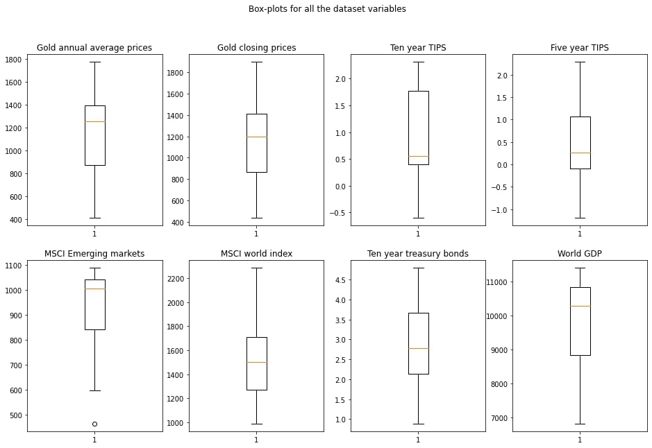

Most of the variables don't have outliers, except the MSCI Emerging markets where there is one, that correspond to the 2004 observation. Removing this outlier don't seem to be the best decision, due to the size of the sample.  

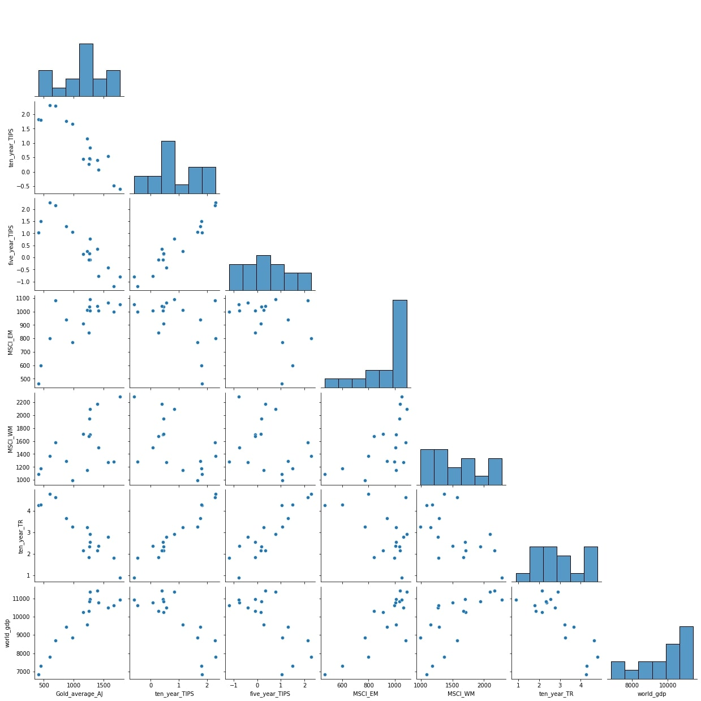
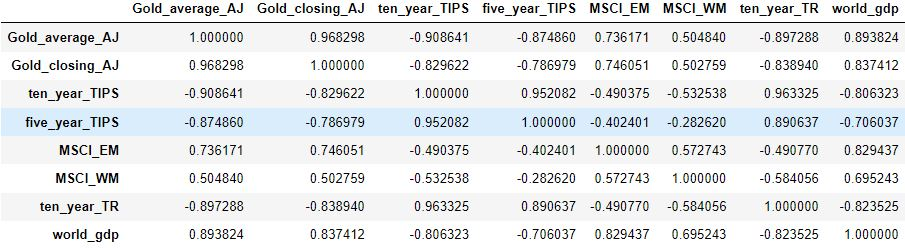

When we test for linearity, using the multiple scatterplot, it is possible to see a linearity with almost all variables, but the MSCI's variables do not seem  to have as clear of a linearity compared with the others. The MSCI_EM variable is a more realiable for the the variance of the gold average prices than the MSCI_WN, at least in this time frame of 2004-2020. The rest of the variables seems to have a high correlation with the dependent variable.

## Multicollinearity in Linear Regression:

Multicollinearity may not be a problem every time, if you care more about how much each individual feature rather than a group of features affects the target variable and if multicollinearity is not present in the features you are interested in.
In this dataset the multicollinearity won't be addressed, because the it is more important the affect of all the variables in the gold prices, but i'm sure that  the analysis of each individual feature would be a good option for this kinda of variables. 

## Model Fits and Regression Analysis.

For a better decision toward which model is the best for the data we have, it was useful to make two models, one without the MSCI_WM and one with that same variable.

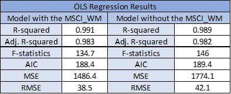

Comparing the models, we don't get a big difference between the two. they both have similar values of R-squared and adjusted R-squared, in either case we reject the null hypothesis and the model fits the data better than the intercept-only model. The main difference between the two is the AIC and the MSE and RMSE, in both cases, the model with the MSCI_WN have the lowest values, so the model has a better fit, lower AIC, and better forecast, lower RMSE. from now on the model that will be used it the residual analysis is the model with the MSCI_WN. 

Using the model predicted and observed values for a simple visualization between the two, it was interesting to make a graph using them both, so below is a figure of the comparison:

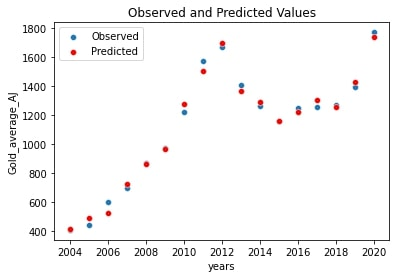

The model  have a R-squared of 0.991, so 99.1% of the variability of the gold prices are explained by the model. When we observe the graph above the predicted values have a small difference from the observed.

## Residual Analysis:

### Homoscedasicity and Independence:

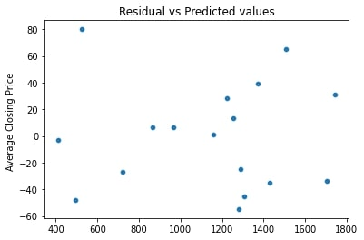

Using a scatterplot with the residuals against the dependent variable, we can see that the residuals don't seem to have any especific pattern. The error apear to be constant along the values of the dependent variable.  

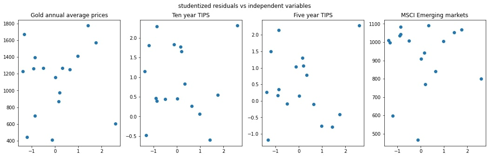
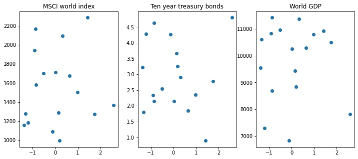

 The residuals vs the independent values appear to be independent  

### Normality:

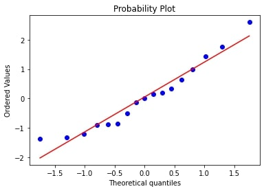
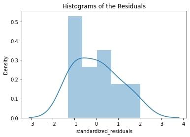

Using a qqplot we can see that the residuals follow the red line and the normality tests(shapiro-wilk and kolmogorov) show that the standardized residuals are normally distributed, we don't reject the null hypothesis for the shapiro-wilk, so for alpha equal to 0.05 the standardized residuals are normally distributed. The kolmogorov we dont reject the null hypothesis with p-value equal to 0.7506071234246195 so for alpha equal to 0.05 the 2 samples are drawn from the same continuous distribution. the Anderson-Darling test also indicate a normality in the residuals. 

### Leverage and Influencial Points:

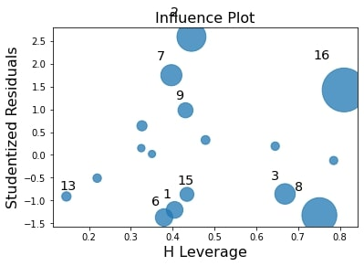
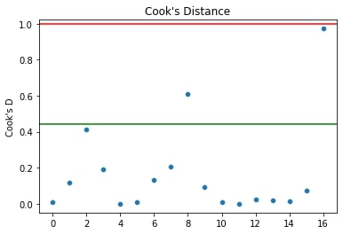

There seems to be a point with high leverage and influence, but some of the other values have high leverage. Surely this big values be consoant to the small sample that it is used.

