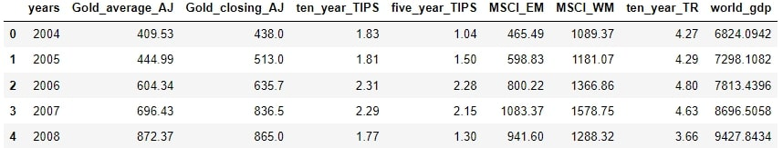
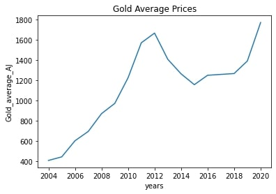

# Data analysis and Gold annual average price prediction.

It is easier to make a model for prediction using the average gold prices from all months, than to choose a month for a closing price,as the independent variables don't need to be correlated by date. So all the data that was a monthly observation needed to be transformed into a annual average.
The variables were aggregated into the dataset below:

&nbsp;

  

    

